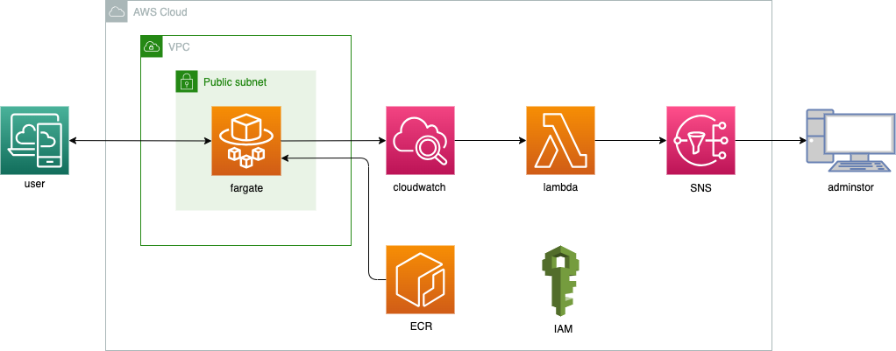
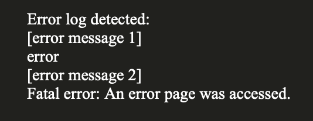

# エラーログ監視アラート: AWS Fargate + CloudWatch + Lambda + SNS

<p align="center">
  
</p>


# 概要
このプロジェクトは、AWSのFargate上で動作するアプリケーションのエラーログをリアルタイムで監視し、問題が発生した際にメールで通知するシステムです。CloudWatchを使用してエラーログを収集・分析し、Lambda関数をトリガーとしてSNSを通じてアラートを送信します。

# 機能一覧
+ エラーログのリアルタイム監視: AWS Fargate上のアプリケーションからCloudWatchに送信されたログを監視。
+ エラーログのフィルタリング: 特定のエラーパターンをCloudWatch Logsでフィルタリング。
+ 自動アラート通知: エラーログが検出された際にLambda関数がトリガーされ、SNS経由でメール通知。
+ 拡張性: 新しいログストリームやエラーパターンに簡単に対応可能。

# インフラ構成
+ AWS Fargate: アプリケーションコンテナを実行。コンテナのログはCloudWatch Logsに送信。
+ Amazon CloudWatch: Fargateコンテナのログを収集・保存し、特定のエラーパターンをフィルタリング。
+ AWS Lambda: CloudWatch Logsでエラーログが検出されると、トリガーされるサーバーレス関数。ログデータを解析し、SNSに通知を送信。
+ Amazon SNS (Simple Notification Service): Lambda関数からの通知を受け取り、設定されたメールアドレスにエラーログのアラートを送信。

このシステムにより、AWS Fargate上で実行されるアプリケーションのエラーログを効果的に監視し、迅速な問題対応が可能になります。


# 起動とデプロイ方法

1. 以下のコードを実行してsnsから受信するアドレスを登録します。
```
bin/create_sns_email_file
```

2. 以下のコードを実行してインフラを構築し、APIサーバーをデプロイします。
```
bin/terraform_apply
```

3. ECSからDNSをコピー
    1. AWS マネジメントコンソールで Amazon Elastic Container Serviceに移動します。
    2. ECS ダッシュボードで、クラスターのリストから対象のクラスターを選択します。
    3. クラスターの詳細画面が表示されたら、左側のナビゲーションメニューから「タスク」を選択します。
    4. タスクのリストから、対象のタスクを選択します。
    5. タスクの詳細画面が表示されたら、画面内の「ネットワーク」セクションをスクロールして、DNS 名を見つけます。
    6. DNS 名の横にあるコピー（Copy）アイコンをクリックして、DNS をクリップボードにコピーします。

4. URLにアクセス

ブラウザを開き、先ほどコピーしたURLにアクセスします。

# 停止
以下のコードを実行すると停止できます。
```
bin/terraform_destroy
```

# 結果

以下のようなメールが届きました。

<p align="center">
  
</p>

# Qiita記事

技術詳細はQiitaに記載しています。

[エラーログ監視アラート: AWS Fargate + CloudWatch + Lambda + SNS](https://qiita.com/sugiyama404/items/77656bed943b529a2c0e)


